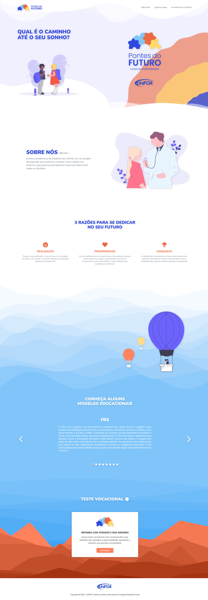

# Projeto Integrador: Desenvolvimento do Site Pontes do Futuro

Este repositório contém o código-fonte e os recursos relacionados ao projeto de desenvolvimento de um site para os alunos da Escola Municipal Prof° Marizinha Félix. O projeto é conduzido pelo curso de Medicina da instituição de ensino UniFOA - Centro Universitário de Volta Redonda, em colaboração com os cursos de Design e Sistemas de Informação, como parte de um projeto integrador.

## Participantes do Projeto:

- **Medicina**: Liderança e desenvolvimento do conteúdo do site
- **Sistemas de Informação**: Desenvolvimento do site
- **Design**: Desenvolvimento da identidade visual

O objetivo principal é criar uma plataforma interativa e informativa para os alunos da Escola Municipal Prof° Marizinha Félix. O site fornecerá informações relevantes sobre o ingresso em cursos, concursos públicos, cursos técnicos e outras oportunidades educacionais. Este projeto é parte integrante do currículo acadêmico e busca unir conhecimentos de diferentes áreas para a construção de uma solução abrangente e de qualidade.

## Links

- **Link do site**: [Pontes do Futuro](https://pontes-do-futuro.vercel.app/)

## Screenshots

### Home

## Identidade Visual

