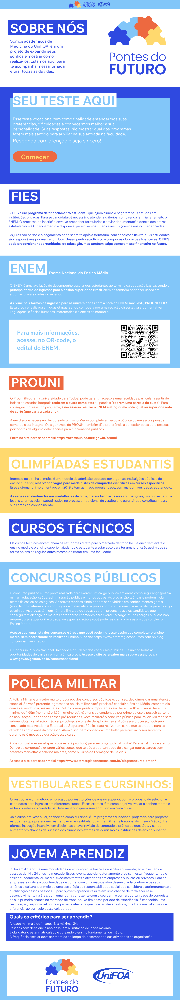

# Projeto Integrador: Desenvolvimento do Site Pontes do Futuro

Este repositório contém o código-fonte e os recursos relacionados ao projeto de desenvolvimento de um site para os alunos da Escola Municipal Prof° Marizinha Félix. O projeto é conduzido pelo curso de Medicina da instituição de ensino UniFOA - Centro Universitário de Volta Redonda, em colaboração com os cursos de Design e Sistemas de Informação, como parte de um projeto integrador.

## Participantes do Projeto:

- **Medicina**: Liderança e desenvolvimento do conteúdo do site
- **Sistemas de Informação**: Desenvolvimento do site
- **Design**: Desenvolvimento da identidade visual

O objetivo principal é criar uma plataforma interativa e informativa para os alunos da Escola Municipal Prof° Marizinha Félix. O site fornecerá informações relevantes sobre o ingresso em cursos, concursos públicos, cursos técnicos e outras oportunidades educacionais. Este projeto é parte integrante do currículo acadêmico e busca unir conhecimentos de diferentes áreas para a construção de uma solução abrangente e de qualidade.

## Ferramentas Utilizadas

- **React.js**: Biblioteca JavaScript para construção de interfaces de usuário.
- **TypeScript**: Linguagem de programação que adiciona tipagem estática ao JavaScript.
- **Zustand**: Biblioteca para gerenciamento de estado em aplicações React.
- **TanStack React Router**: Biblioteca de roteamento para React, permitindo a criação de aplicativos de página única (SPAs) com navegação dinâmica.
- **Vite**: Ferramenta de build e desenvolvimento rápida e leve para projetos web modernos.
- **SASS**: Pré-processador CSS que permite o uso de variáveis, aninhamento e outras funcionalidades avançadas.
- **ESLint**: Ferramenta de linting para JavaScript e TypeScript, ajudando a manter um código consistente e livre de erros.

## Links

- **Link do site**: [Pontes do Futuro](https://pontesdofuturo.vercel.app)

## Identidade Visual

## Screenshot

## Protótipo

- Protótipo visual desenvolvido pelos alunos de Design no Figma, representando a estrutura e a identidade visual do site "Pontes do Futuro".

